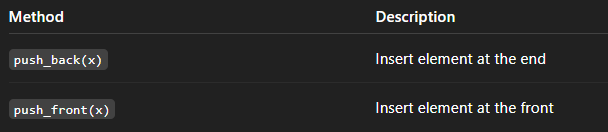
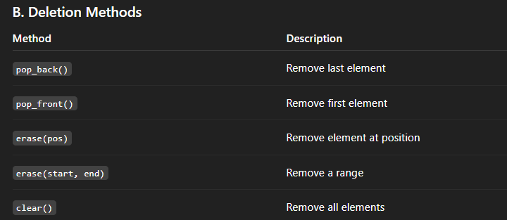
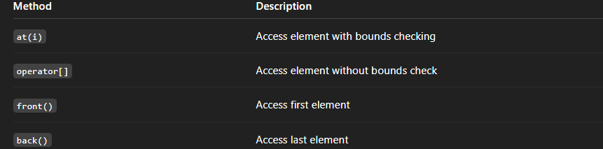
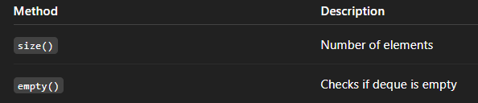

# 1. What is deque?

- deque stands for Double Ended Queue
- Allows fast insertion and deletion at both front and back
- Dynamic size (can grow or shrink)

2. Key Characteristics

- Elements are stored in non-contiguous memory
- Supports random access like arrays (dq[i])

# Insertion:



# Deletion:



# Access:



# Size & Empty



# Iteration

```c

for(auto it = dq.begin(); it != dq.end(); it++)
    cout << *it << " ";

```