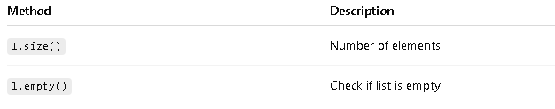
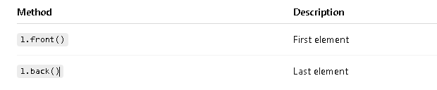
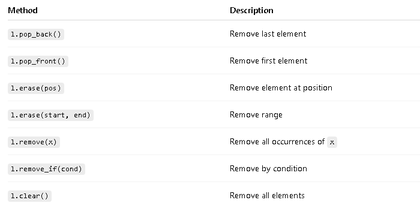

# std::list (C++ STL)

- std::list is a doubly linked list.
- Elements are not stored contiguously.
- Allows fast insertion and deletion anywhere.
- No random access (no indexing like []).

# Declaration and initialization

```c

list<int> l;                  // empty list
list<int> l(5);               // size 5, default initialized
list<int> l(5, 10);           // size 5, all values = 10
list<int> l2 = {1, 2, 3};     // initializer list

```

# Size and empty


# Accessing Elements:


# Adding Elements:
```c
l.push_front(5);
l.push_back(10);
```

# Removing Elements:



# Example Program:

```c

#include <iostream>
#include <list>
using namespace std;

int main() {
    list<int> l = {3, 1, 2};
    l.sort();

    for(int x : l)
        cout << x << " ";

    return 0;
}

```


<!-- Deque stack, map and multimap, function of iterator algo: find, count and sort, algorithms: search, merge, for_each and transform -->