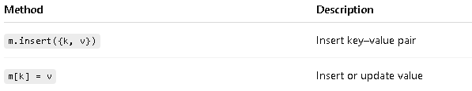
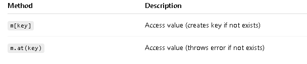
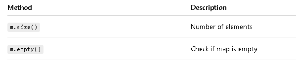
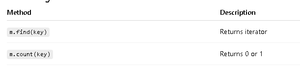
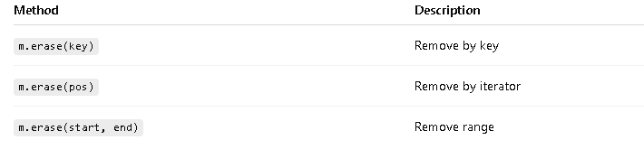

# std::map (C++ STL)

- std::map stores elements as key–value pairs.
- Keys are unique.
- Elements are stored in sorted order by key.


# Declaration:

```c
map<int, string> m;                      // empty map
map<int, string> m = {{1,"A"}, {2,"B"}}; // initializer list

```

# Insertion


# Access




# Size & Status



# Searching



# Removal



# Example

```c

#include <iostream>
#include <map>
using namespace std;

int main() {
    map<int, string> m;
    m[1] = "One";
    m[2] = "Two";

    for(auto p : m)
        cout << p.first << " -> " << p.second << endl;

    return 0;
}
```