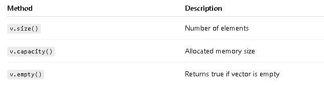
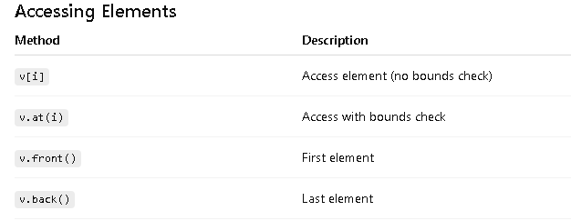
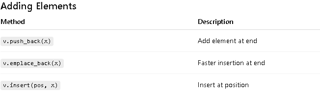
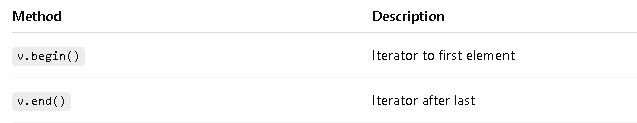

# std::vector (C++ STL)

- What is a vector?

    - std::vector is a dynamic array.
    - It can grow or shrink in size automatically.
    - Elements are stored in contiguous memory (like arrays).

# Declaration & Initialization
```c
vector<int> v;                 // empty vector
vector<int> v(5);              // size 5, default initialized (0)
vector<int> v(5, 10);          // size 5, all values = 10
vector<int> v2 = {1, 2, 3};    // initializer list
```

# Size & Capacity



# Accessing Elements



- example: 

``` c

cout << v[0];
cout << v.at(1);

```



- Example:

```c
v.push_back(10);
v.insert(v.begin(), 5);
```

# Removing Elements:


# Iterators



```c

for(auto it = v.begin(); it != v.end(); it++)
    cout << *it << " ";
```

# Example program:

```c

#include <iostream>
#include <vector>
using namespace std;

int main() {
    vector<int> v = {1, 2, 3};
    v.push_back(4);

    for(int x : v)
        cout << x << " ";

    return 0;
}

```