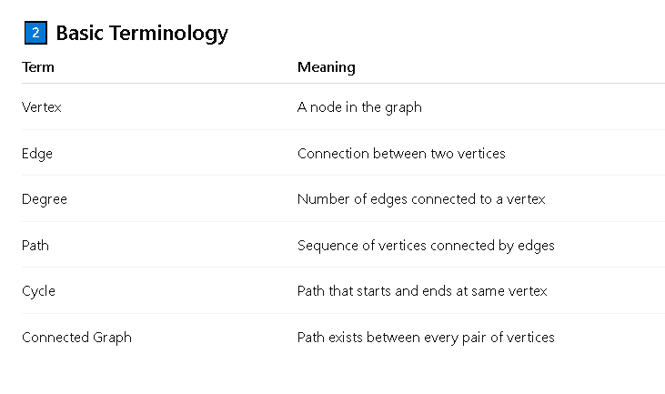
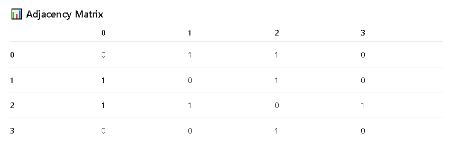

# 1️⃣ What is a Graph?

- A graph is a non-linear data structure used to represent relationships between objects.
- A graph consists of:

    -   Vertices (Nodes) → entities
    -   Edges → connections between entities

## 📌 Example
- Cities connected by roads
- People connected in a social network
- Computers connected in a network




# 3️⃣ Types of Graphs
- 🔹 Based on Direction

    -   Undirected Graph → edges have no direction
    -   Directed Graph (Digraph) → edges have direction

- 🔹 Based on Weight

    -   Weighted Graph → edges have weights/cost
    -   Unweighted Graph → no weights

# Adjacency Matrix:

For the graph:

```bash

   1
  / \
 0---2---3

```
