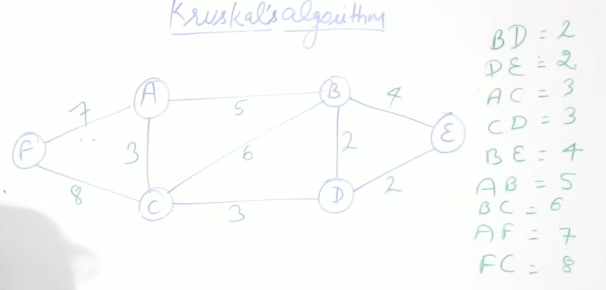

Kruskal's Algorithm:

Parallel edges: if there are, say, more than one edges from vertex a to b then they are said to be parallel edges.
Loops: if a root starts and ends at the same vertex

=> Remove all parallel edges and loops

# Write all the edges in their increasing weight order:

