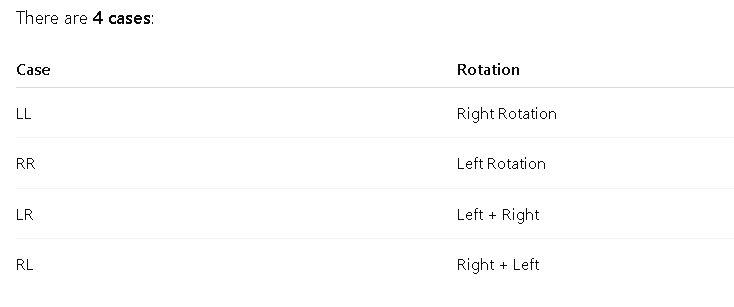

# AVL TREE (Self-Balancing BST)
# What is an AVL Tree?

An AVL Tree is a Binary Search Tree (BST) that automatically keeps itself balanced.

- Balance means:
the height difference between left and right subtrees is at most 1
AVL = Adelson-Velsky and Landis

- Why AVL Tree?

    - Normal BST can become skewed (like a linked list).
    - Example (bad BST):

```bash
10
\
20
    \
    30
```

    - ⛔ Search becomes O(n)
    - AVL Tree fixes this by rotations.

# Properties of AVL Tree

- 1️⃣ BST Property
Left < Root < Right

- 2️⃣ Balance Factor (BF)
BF = Height(left subtree) − Height(right subtree)

- Allowed values:

-1 , 0 , +1
- If BF becomes -2 or +2 → tree is unbalanced

- Height Definition

    - Height of empty tree = -1

    - Height of leaf node = 0


# ROTATIONS (Core of AVL)

Whenever imbalance happens → ROTATE




## LL ROTATION (Left-Left)

When?

- Insertion in left subtree of left child

- Example:

Insert: 30, 20, 10
```bash
Before rotation:

    30
   /
 20
 /
10


BF of 30 = +2 ❌

- Right Rotation:
    20
   /  \
 10   30
```

✅ Balanced

## RR ROTATION (Right-Right)
When?

- Insertion in right subtree of right child

- Example:

Insert: 10, 20, 30
```bash
Before rotation:

10
  \
   20
     \
      30


BF of 10 = -2 ❌

Left Rotation:
    20
   /  \
 10   30
```

✅ Balanced

- LR ROTATION (Left-Right)

When?

- Insertion in right subtree of left child

- Example:

- Insert: 30, 10, 20
```bash
Before:

    30
   /
 10
   \
    20

- Step 1: Left Rotate (10)
    30
   /
 20
 /
10

- Step 2: Right Rotate (30)
    20
   /  \
 10   30

```
✅ Balanced

## RL ROTATION (Right-Left)
When?

- Insertion in left subtree of right child

- Example:

- Insert: 10, 30, 20

Before:
```bash
10
  \
   30
  /
 20

- Step 1: Right Rotate (30)
10
  \
   20
     \
      30

- Step 2: Left Rotate (10)
    20
   /  \
 10   30
```

✅ Balanced

# AVL INSERTION

Steps

-Insert node like normal BST

-Update height

- Calculate Balance Factor

- Apply rotation if needed

