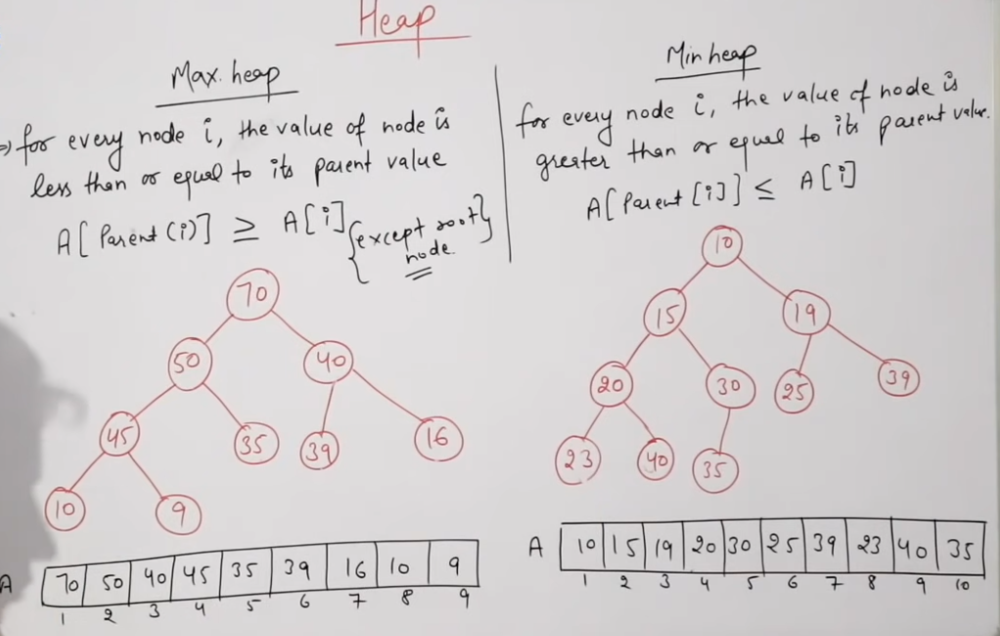
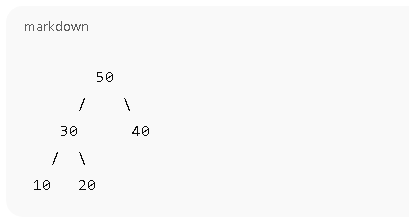

# What is a Heap?

A Heap is a special complete binary tree used when we want:

- Quick access to the maximum or minimum element
- Heaps are mostly implemented using arrays, not pointers.

# Properties of a Heap

- 1️⃣ Complete Binary Tree

    - All levels are completely filled

    - Last level is filled from left to right

- 2️⃣ Heap Property

There are two types of heaps:

| Heap Type | Rule                |
|----------|---------------------|
| Max Heap | Parent ≥ Children   |
| Min Heap | Parent ≤ Children   |


# Array Representation of Heap

For an element at index i:
```bash
Parent index     = (i - 1) / 2
Left child index = 2*i + 1
Right child index= 2*i + 2
```

# MAX HEAP

Example Max Heap (Array)
```bash
Index:  0   1   2   3   4
Value: [50, 30, 40, 10, 20]
```




# MAX HEAP INSERTION

Rule

- Insert element at end
- Compare with parent
- Swap if child > parent
- Repeat until heap property satisfied

## Example: Insert 60

- Initial Heap:

[50, 30, 40, 10, 20]


- Step 1 – Insert at end:

[50, 30, 40, 10, 20, 60]


- Step 2 – Heapify Up:

- 60 > 40 → swap

[50, 30, 60, 10, 20, 40]

- 60 > 50 → swap
[60, 30, 50, 10, 20, 40]


✅ Max Heap restored

# MAX HEAP DELETION (Delete Root)

Rule

- Remove root element
- Move last element to root
- Compare with children
- Swap with larger child
- Repeat until heap property satisfied


Example: Delete Max (60)

- Initial Heap:

[60, 30, 50, 10, 20, 40]


- Step 1 – Replace root with last:

[40, 30, 50, 10, 20]


- Step 2 – Heapify Down:

    - 40 < 50 → swap
        [50, 30, 40, 10, 20]

✅ Max Heap restored


# MIN HEAP

- Example Min Heap (Array)
[10, 20, 30, 40, 50]

## MIN HEAP INSERTION

Rule

- Insert at end
- Compare with parent
- Swap if child < parent

Example: Insert 5

- Initial:

[10, 20, 30, 40, 50]

- Insert at end:

[10, 20, 30, 40, 50, 5]

- Heapify Up:

5 < 30 → swap
[10, 20, 5, 40, 50, 30]

- 5 < 10 → swap
[5, 20, 10, 40, 50, 30]


✅ Min Heap restored

## MIN HEAP DELETION (Delete Root)
Rule

- Remove root (minimum)
- Move last element to root
- Swap with smaller child
- Repeat until heap property satisfied


## Example: Delete Min (5)

- Initial:

[5, 20, 10, 40, 50, 30]


- Replace root:

[30, 20, 10, 40, 50]


- Heapify Down:

30 > 10 → swap
[10, 20, 30, 40, 50]


✅ Min Heap restored