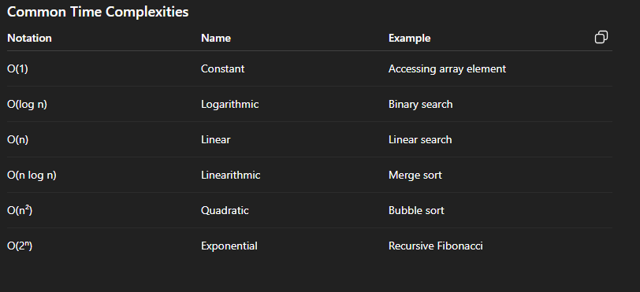
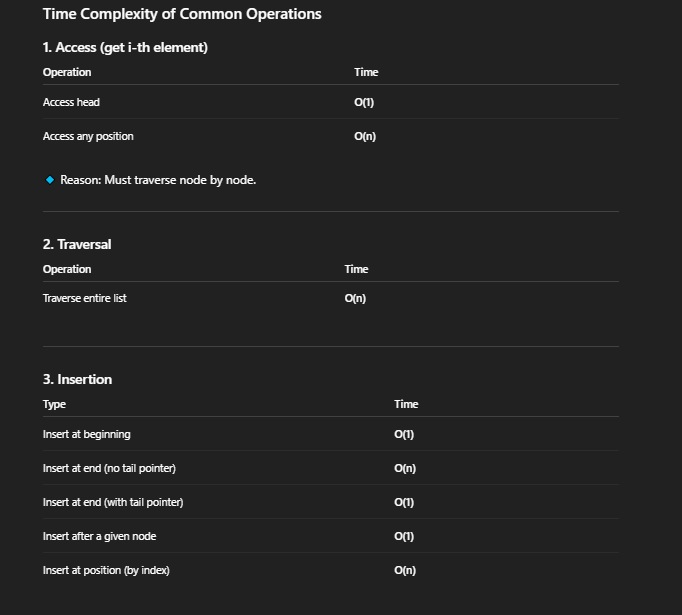
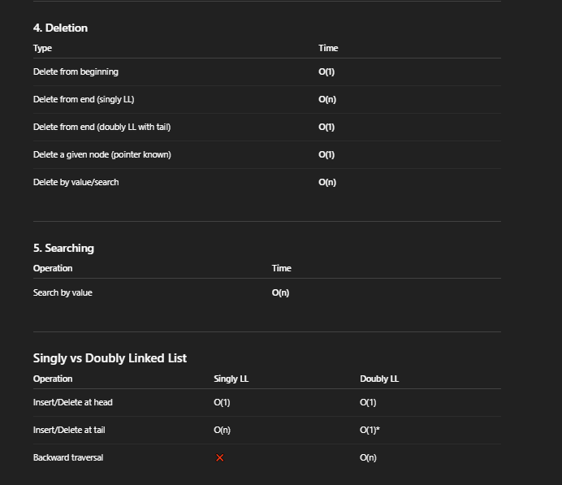
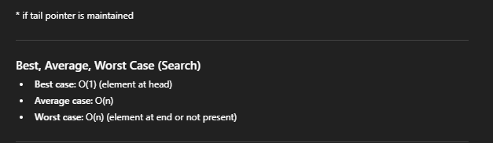
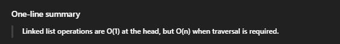

1. Time Complexity

Time complexity tells us how the running time of an algorithm grows with input size (n).

👉 It does not measure actual seconds, but the number of operations.



# Types of Time Complexity

- Best Case – minimum time
- Average Case – expected time
- Worst Case – maximum time (most important)

# Example:

```c
for i = 1 to n:
   print(i)

```

Runs n times → O(n)


# Detailed time complexity of a linked list:






# ADT time complexities:

- Stack

Stack allows insertion and deletion only at one end (LIFO), with push and pop in O(1) time.

- Queue

Queue follows FIFO order, where insertion (enqueue) and deletion (dequeue) take O(1) time.

- Priority Queue

Priority queue stores elements by priority, where insertion and deletion take O(n) time.

- Tree

Tree is a hierarchical data structure where searching, insertion, and deletion typically take O(log n) time (in balanced trees).

- Deque (Double-Ended Queue)

Deque allows insertion and deletion at both ends, all in O(1) time.