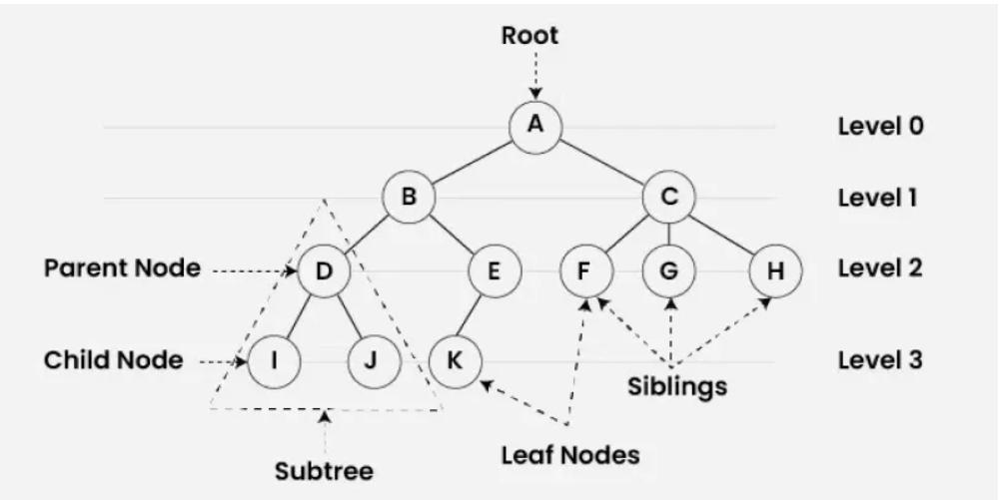
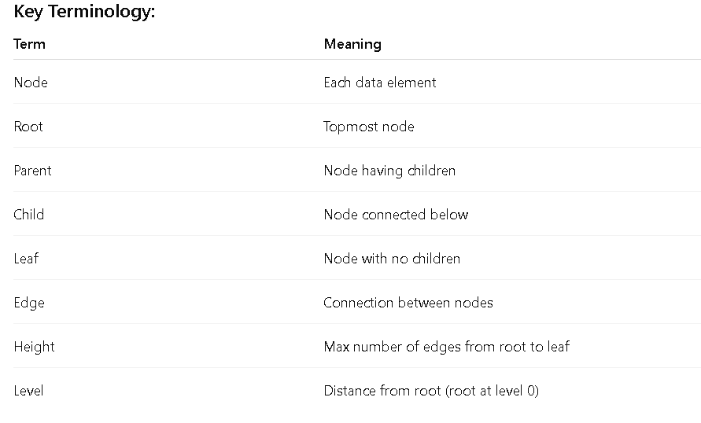

# 1️⃣ What is a Tree?

Tree Data Structure is a non-linear data structure in which a collection of elements known as nodes are connected to each other via edges such that there exists exactly one path between any two nodes.



# Terms:




# 2️⃣ Binary Tree

A Binary Tree is a tree in which each node can have at most 2 children:

Left child
Right child

# 3️⃣ Types of Binary Trees

## ✅ (A) Complete Binary Tree

- Definition:
A binary tree in which all levels are completely filled except possibly the last, and last level nodes are filled from left to right.

        1
       / \
      2   3
     / \  /
    4  5 6


## ✅ (B) Extended (Full / Strict) Binary Tree

- Definition:
A binary tree in which every node has either 0 or 2 children.

        1
       / \
      2   3
         / \
        4   5


❌ Node with only one child is not allowed


# 4️⃣ Binary Search Tree (BST)

A Binary Search Tree is a binary tree with a special ordering property:

🔑 BST Property:

Left subtree → values less than root

Right subtree → values greater than root

        50
       /  \
     30    70
    / \    / \
  20  40  60  80


# 6️⃣ Tree Traversals (Recursive)

Traversal means visiting each node exactly once.

## 🌿 (A) In-Order Traversal (LNR)

- Order:
Left → Node → Right

- 🔹 Used for:

Printing BST in sorted order

```c
void inorder(Node* root) {
    if (root == NULL) return;

    inorder(root->left);
    cout << root->data << " ";
    inorder(root->right);
}
```


- 📌 BST Inorder output is always sorted
## 🌿 (B) Pre-Order Traversal (NLR)

- Order:
Node → Left → Right


```c
void preorder(Node* root) {
    if (root == NULL) return;

    cout << root->data << " ";
    preorder(root->left);
    preorder(root->right);
}
```


## 🌿 (C) Post-Order Traversal (LRN)

- Order:
Left → Right → Node

```c
void postorder(Node* root) {
    if (root == NULL) return;

    postorder(root->left);
    postorder(root->right);
    cout << root->data << " ";
}
```